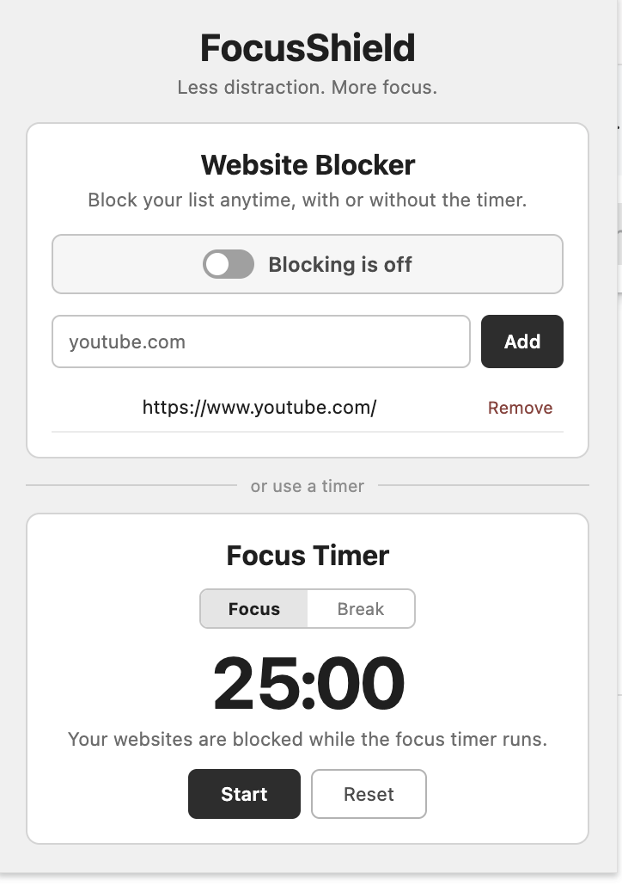
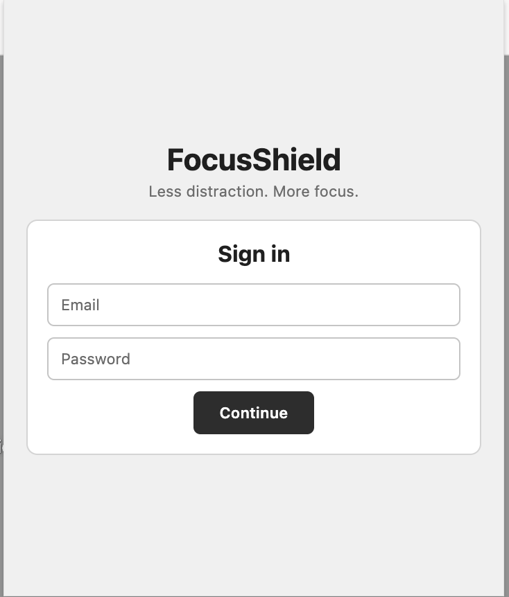
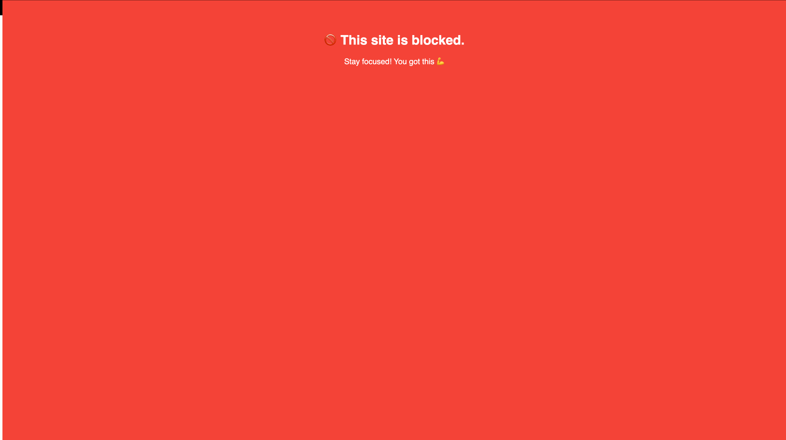

# FocusShield

**Less distraction. More focus.**

FocusShield is a Chrome extension that helps you stay focused by blocking distracting websites. You can turn blocking on manually whenever you need it, or use the built-in focus timer to automatically block your selected sites during a focus session.

> **Beta:** FocusShield is currently in beta testing and is not yet published on the Chrome Web Store.

## Preview

### Dashboard

<p align="center">
  
</p>

### Sign in

<p align="center">
  
</p>

### Blocked website page

<p align="center">
  
</p>

## Features

- Add and remove websites from your personal block list
- Turn website blocking on or off manually
- Start a 25-minute focus session that automatically enables blocking
- Pause a focus session to temporarily restore access
- 5-minute break sessions with websites unblocked
- Timer and blocking state persist when the extension popup is closed
- Account-based block lists using Firebase

## Install the Beta

FocusShield is currently distributed as an unpacked Chrome extension.

### 1. Download FocusShield

Download the FocusShield beta ZIP and unzip it on your computer.

### 2. Open Chrome Extensions

In Google Chrome, enter the following in the address bar:

```text
chrome://extensions
```

### 3. Enable Developer Mode

Turn on **Developer mode** using the toggle in the top-right corner of the Extensions page.

### 4. Load FocusShield

Click **Load unpacked** and select the unzipped FocusShield `dist` folder.

### 5. Pin the Extension

Click the Extensions icon in the Chrome toolbar and pin **FocusShield** for easy access.

FocusShield is now ready to use.

## Using FocusShield

### Manual Website Blocking

1. Sign in to FocusShield.
2. Add a website such as `youtube.com` to your block list.
3. Turn **Blocking** on.
4. Attempts to visit a blocked website will be redirected to the FocusShield blocked page.
5. Turn blocking off whenever you want normal access again.

### Focus Timer

1. Add the websites you want to block.
2. Press **Start** under Focus Timer.
3. Your block list is automatically activated for the 25-minute focus session.
4. Pausing the timer temporarily disables timer-based blocking.
5. When the focus session finishes, blocking is disabled and FocusShield switches to a 5-minute break.

Manual blocking and timer-based blocking work independently. If manual blocking is enabled, your websites remain blocked even when the focus timer is paused or reset.

## Beta Feedback

FocusShield is actively being tested. If you encounter a bug or unexpected behavior, please open a GitHub issue with:

- What you were trying to do
- What happened
- What you expected to happen
- Your Chrome version, if relevant

## Status

FocusShield is currently a beta project. Features and behavior may change as testing continues.
